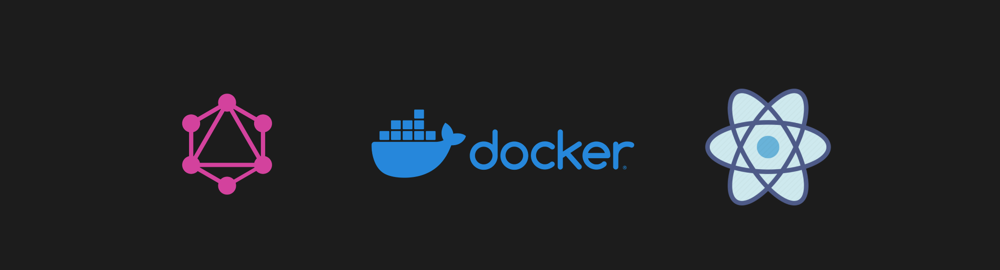

# Getting Started with Create React App
**By Juan P. Ortiz**



This project was bootstrapped with [Create React App](https://github.com/facebook/create-react-app).

## Available Scripts

In the project directory, you can run:

### `npm start`

Runs the app in the development mode.  
Open [http://localhost:3000](http://localhost:3000) to view it in the browser.

The page will reload if you make edits.  
You will also see any lint errors in the console.

### `npm test`

Launches the test runner in the interactive watch mode.  
See the section about [running tests](https://facebook.github.io/create-react-app/docs/running-tests) for more information.

### `npm run build`

Builds the app for production to the `build` folder.  
It correctly bundles React in production mode and optimizes the build for the best performance.

The build is minified and the filenames include the hashes.  
Your app is ready to be deployed!

See the section about [deployment](https://facebook.github.io/create-react-app/docs/deployment) for more information.

### `npm run eject`

**Note: this is a one-way operation. Once you `eject`, you can’t go back!**

If you aren’t satisfied with the build tool and configuration choices, you can `eject` at any time. This command will remove the single build dependency from your project.

Instead, it will copy all the configuration files and the transitive dependencies (webpack, Babel, ESLint, etc) right into your project so you have full control over them. All of the commands except `eject` will still work, but they will point to the copied scripts so you can tweak them. At this point you’re on your own.

You don’t have to ever use `eject`. The curated feature set is suitable for small and middle deployments, and you shouldn’t feel obligated to use this feature. However, we understand that this tool wouldn’t be useful if you couldn’t customize it when you are ready for it.

## Learn More

You can learn more in the [Create React App documentation](https://facebook.github.io/create-react-app/docs/getting-started).

To learn React, check out the [React documentation](https://reactjs.org/).

---

## Docker Setup

This project also supports Docker for containerization, which allows you to run the app in an isolated environment.

### Prerequisites

Ensure Docker and Docker Compose are installed on your machine.  
You can install Docker from [Docker's official website](https://docs.docker.com/get-docker/).


### Build and Run with Docker

1. **Build the Docker image** (if you haven’t built it before):
   ```bash
   docker-compose up --build
   ```

2. **Start the container**:
   ```bash
   docker-compose up
   ```

3. **Access the app** at [http://localhost:3000](http://localhost:3000).

### Rebuilding the Container after Changes

When you modify dependencies (e.g., install new npm packages), you may need to rebuild the Docker image:

```bash
docker-compose down
docker-compose up --build
```

However, with the volume configuration in place, you **don’t need to rebuild** the container for regular code changes — they will be reflected automatically.

### Troubleshooting Docker Issues

1. **Clear Docker Cache**:
   ```bash
   docker builder prune -af
   ```

2. **Stop and Remove Containers and Volumes**:
   ```bash
   docker-compose down --volumes
   ```

3. **Verify Containers and Volumes**:
   ```bash
   docker ps -a  # List all containers
   docker volume ls  # List all volumes
   ```

This Docker setup ensures a smooth development experience with hot-reloading enabled. Let me know if you encounter any further issues!
